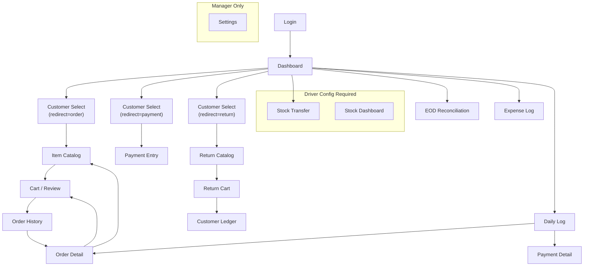

# Van Sale — Product Requirements Document

## 1. App Overview

**Van Sale** is a mobile-first Progressive Web App (PWA) that gives field sales drivers a unified workspace to create orders, collect payments, manage van stock, process returns, log expenses, and close their day — all powered by a Frappe/ERPNext backend. It replaces fragmented desktop workflows with a touch-optimized, offline-aware interface designed for use on delivery routes.

---

## 2. Core Features

- **Field Order Entry** — Select a customer, browse a price-list-aware catalog, build a cart with editable rates, and submit Sales Orders directly into ERPNext.
- **Payment Collection & Allocation** — Collect receivables with Auto-FIFO, Manual, or Advance allocation against outstanding Sales Invoices or Sales Orders.
- **Van Stock Management** — Real-time stock dashboard for the driver's assigned van warehouse with low-stock alerts, plus a guided Material Transfer flow from the source warehouse.
- **Sales Returns** — Select items previously sold to a customer, review return quantities, and issue credit via a backend Credit Note.
- **End-of-Day Reconciliation** — Auto-generated financial summary (sales, collections, expenses) with declared-cash-vs-expected variance tracking, submitted as a Van EOD Report.

---

## 3. User Stories

| # | Persona | Story |
|---|---------|-------|
| 1 | **Driver** | *As a van driver, I want to browse my catalog filtered by the customer's price list and instantly see van stock levels so I can place accurate orders on-site without calling the office.* |
| 2 | **Driver** | *As a driver collecting a cheque, I want to allocate the payment against the customer's oldest invoices (FIFO) or manually pick specific invoices, so the customer's ledger is updated in real-time.* |
| 3 | **Driver** | *As a driver returning unsold goods, I want to select items and quantities so a Credit Note is created and the customer's outstanding balance is reduced automatically.* |
| 4 | **Sales Manager** | *As a sales manager, I want to create and configure driver profiles (warehouse mapping, payment modes, credit limits) from a single settings screen, so onboarding a new driver takes minutes.* |
| 5 | **Driver** | *As a driver ending my shift, I want to declare my cash on hand and see any variance against expected collections, so discrepancies are documented before I return to the depot.* |

---

## 4. User Roles (RBAC)

| Role | Access Level |
|------|-------------|
| **System Manager** | Full admin — CRUD on all doctypes, all API endpoints, can delete records. |
| **Sales Manager** | Operations manager — manage driver profiles, view all reports, approve stock loads. Cannot delete. |
| **Van Sales Driver** | Field-only — create orders, collect payments, log expenses. Row-level data isolation (own data only). |

---

## 5. Screen Inventory

### 5.1 Login Screen
**Route:** `/login`

| Aspect | Detail |
|--------|--------|
| **Purpose** | Authenticate the user against ERPNext credentials and bootstrap the session (user info, driver config, roles). |
| **Key Elements** | App branding headline · Feature highlight cards (Orders, Payments, Profiles) · Username input · Password input · "Sign in" button · Error message banner |
| **Functionality** | `POST` to Frappe login API → on success, store `UserSession` in Pinia (includes `driver_config`, `is_manager`, `is_driver`) and redirect to Dashboard. On failure, show inline error. |
| **Navigation** | → **Dashboard** (on success). Authenticated users hitting `/login` are auto-redirected to Dashboard. |

---

### 5.2 Dashboard
**Route:** `/` (home)

| Aspect | Detail |
|--------|--------|
| **Purpose** | Central hub showing today's KPIs and providing one-tap access to every workflow. |
| **Key Elements** | Setup warning banner (if no driver profile) · **Quick Actions grid** (New Order, Payment, Load Stock, End of Day, Return, Expense — 6 icon buttons) · **Today's Performance** cards (Sales count/total, Collections count/total) · **Recent Activity** list (last N orders with customer name, amount, status badge) |
| **Functionality** | On mount: parallel fetch `recentOrders()` + `getDailySummary()`. Performance cards are tappable — navigate to Daily Log (orders/payments). Recent order rows navigate to Order Detail. Quick Action buttons route through Customer Select with a `redirect` query param to control downstream flow. Stock/Settings buttons are conditionally shown based on `driverConfig` / `isManager`. |
| **Navigation** | → Customer Select (New Order / Payment / Return) · → Stock Transfer · → EOD Reconciliation · → Expense Log · → Order Detail · → Daily Log (orders or payments) |

---

### 5.3 Customer Select
**Route:** `/customers`

| Aspect | Detail |
|--------|--------|
| **Purpose** | Search and pick a customer before entering the order, payment, ledger, or return workflow. Acts as a routing gateway. |
| **Key Elements** | Back button · Search input (debounced 300ms) · Customer list (name, ID, territory badge) · Loading skeleton · "Current Action" info card explaining the downstream flow |
| **Functionality** | Fetches customers via `searchCustomers(txt)` on mount and on search change. On selection, stores customer in Pinia and routes based on `redirect` query param: `order` → Item Catalog, `payment` → Payment Entry, `ledger` → Customer Ledger, `return` → Return Catalog. |
| **Navigation** | → Item Catalog · → Payment Entry · → Customer Ledger · → Return Catalog · ← Back (previous screen) |

---

### 5.4 Item Catalog
**Route:** `/items`

| Aspect | Detail |
|--------|--------|
| **Purpose** | Browse the product catalog, see real-time van stock and prices, and add items to the order cart. |
| **Key Elements** | Back button · Sticky search bar with icon · Item list rows (name, code, price, stock badge — Out of Stock / Low / Available) · Per-item quantity stepper (+/−) · **Floating cart summary bar** (total + "Checkout (N)" button) |
| **Functionality** | Loads items via `listItems(search, customer)` — returns items with `price_list_rate` and `actual_qty` from the van warehouse. Debounced search (300ms). Add button is disabled for out-of-stock items. Cart state is managed in Pinia (`addToCart`, `updateQty`). Resumes existing draft order items if `currentOrderName` is set. |
| **Navigation** | → Cart View (via floating bar) · ← Customer Select |

---

### 5.5 Cart / Review Order
**Route:** `/cart`

| Aspect | Detail |
|--------|--------|
| **Purpose** | Review, adjust quantities and prices, and confirm the order before submission. |
| **Key Elements** | Customer info card · Item list with quantity stepper (+/−) and editable price chip · Subtotal / Tax / Grand Total breakdown · "Clear All" button · **Sticky "Confirm Order"** button · **Edit Price modal** (bottom sheet with override input and Apply/Cancel) |
| **Functionality** | Tapping the price chip opens a bottom-sheet modal to override the unit rate (`updateRate`). On confirm: builds `itemsPayload`, calls `createSalesOrder()` or `updateSalesOrder()` (for existing drafts). On success, clears cart and navigates to History. Tax is pulled from the existing order detail if available. |
| **Navigation** | → History (on submit) · → Item Catalog (Browse Catalog button) · ← Back |

---

### 5.6 Order History
**Route:** `/history`

| Aspect | Detail |
|--------|--------|
| **Purpose** | List recently created orders for quick review and follow-up. |
| **Key Elements** | "New Order" button · Refresh button · Order cards (customer name, order ID, date, status pill, grand total) · Empty state · Loading skeleton |
| **Functionality** | Fetches `recentOrders(user)` on mount. Each card is tappable → Order Detail. |
| **Navigation** | → Order Detail · → Customer Select (New Order) |

---

### 5.7 Order Detail
**Route:** `/orders/:name`

| Aspect | Detail |
|--------|--------|
| **Purpose** | Inspect a specific Sales Order — line items, totals, status — and perform actions (submit, edit, print). |
| **Key Elements** | Order header (ID, customer, date, status pill, docstatus pill) · Grand Total · Company & Price List info · Items table (name, code, UOM, rate, qty, amount, delivery date) · **Action buttons**: Submit Order (draft only), Edit Items (draft), Add Items (draft), Print Receipt (submitted), Open in ERPNext, Reload |
| **Functionality** | Fetches `getSalesOrder(name)`. Submit calls `submitSalesOrder()` then reloads. Edit Items pre-loads cart from order items and navigates to Cart. Add Items navigates to Item Catalog. Print Receipt calls `downloadPdf('Sales Order', name)`. Open in ERPNext opens `/app/sales-order/:name` in a new tab. |
| **Navigation** | → Cart (Edit Items) · → Item Catalog (Add Items) · → ERPNext desk (external) · ← Back |

---

### 5.8 Payment Entry
**Route:** `/payment`

| Aspect | Detail |
|--------|--------|
| **Purpose** | Create a Payment Entry against a customer — the core receivable collection workflow. |
| **Key Elements** | Customer card (with Change button) · **Customer Summary** banner (outstanding balance, last invoice, last payment) · Mode of Payment dropdown · Paid Amount input · **Allocation Type** toggle (Auto FIFO / Manual / Advance) · Outstanding Invoices list with checkboxes and editable allocation amounts · Invoice search (manual mode) · Sales Order list with radio buttons (advance mode) · Unallocated amount indicator · **Sticky "Confirm Payment"** button |
| **Functionality** | On mount: fetches `getPaymentModes()`, `getOutstandingInvoices()`, `getSalesOrders()`, `getCustomerSummary()`. **Auto mode**: entering an amount triggers FIFO allocation across invoices sorted by posting date. **Manual mode**: tap invoices to select, edit allocation per invoice, paid amount auto-sums. **Advance mode**: optionally link to a Sales Order or leave unlinked. Submit calls `createPaymentEntry(customer, mode, amount, references, salesOrder)`. |
| **Navigation** | → Customer Select (Change customer) · ← Back (on success or cancel) |

---

### 5.9 Payment Detail
**Route:** `/payment-detail/:name`

| Aspect | Detail |
|--------|--------|
| **Purpose** | Read-only view of a submitted Payment Entry — amount, mode, allocation references. |
| **Key Elements** | Customer name + status badge · Date + Mode grid · Amount Paid (large) · "Allocated To" list (reference doctype, name, allocated amount) · Print Receipt button |
| **Functionality** | Fetches `getPaymentEntry(name)`. Print Receipt calls `downloadPdf('Payment Entry', name)`. |
| **Navigation** | ← Back |

---

### 5.10 Customer Ledger
**Route:** `/ledger`

| Aspect | Detail |
|--------|--------|
| **Purpose** | Review a customer's financial history — invoiced amounts, receipts, and running balance over a configurable period. |
| **Key Elements** | Customer selector (with Change) · Period dropdown (Last Week / Month / 3 Months / 6 Months) · Opening Balance card · Invoiced vs. Received summary cards · Transaction list (icon per type, description, date, voucher number, debit/credit amount, running balance) · **Outstanding Balance** gradient card at bottom |
| **Functionality** | Calls `getCustomerLedger(customer, from, to)` which returns `{ opening_balance, entries[] }`. Computes running balance per entry. Debit = Invoice (red), Credit = Payment (green). Period change triggers re-fetch via watcher. |
| **Navigation** | → Customer Select (Change customer) · ← Back |

---

### 5.11 Daily Log
**Route:** `/daily-log/:type` (type = `orders` | `payments`)

| Aspect | Detail |
|--------|--------|
| **Purpose** | View all of today's Sales Orders or Payment Entries in one place, with totals and mode-of-payment breakdown. |
| **Key Elements** | Back button · **Payment Summary card** (total collection + per-mode breakdown grid — payments only) · Transaction cards (customer/party name, ID, status pill, mode-of-payment tag, date, amount) · Empty state |
| **Functionality** | Calls `getDailyLog(doctype)`. Tapping a card navigates to Order Detail or Payment Detail depending on type. Status badges are color-coded (Draft, Submitted, Paid, etc.). |
| **Navigation** | → Order Detail (orders) · → Payment Detail (payments) · ← Dashboard |

---

### 5.12 Driver Stock Dashboard
**Route:** `/stock` (requires driver config)

| Aspect | Detail |
|--------|--------|
| **Purpose** | Live view of all items in the driver's assigned van warehouse with low-stock alerts. |
| **Key Elements** | Refresh button · Offline snapshot warning banner · Error banner · No-profile message · **Summary grid** (Items count, Low Stock count, Available Qty, Reserved Qty) · Source Warehouse + Low Threshold info · Search/filter input · Stock item cards (name, code, UOM, Available / Reserved / Projected quantities, "Low" badge) |
| **Functionality** | Calls `getDriverStockDashboard(forceRefresh)`. Caches response in `localStorage` — if API fails, falls back to cached snapshot with warning. Search filters items client-side by name or code. Requires `driverConfig` (route guard redirects to Dashboard with setup prompt if missing). |
| **Navigation** | ← Dashboard (via nav) |

---

### 5.13 Stock Transfer (Load Van)
**Route:** `/transfer` (requires driver config)

| Aspect | Detail |
|--------|--------|
| **Purpose** | Build and submit a Material Transfer (Stock Entry) from the main warehouse to the van warehouse. |
| **Key Elements** | From/To warehouse display · Optional remarks textarea · Search input for source items · Source item results (name, code, UOM, available qty, batch/serial indicators, Add button) · **Transfer Lines** list (qty input, batch dropdown, serial number textarea, Remove button, available qty) · **Sticky footer** (line count + Submit Transfer button) |
| **Functionality** | Searches source warehouse items via `searchTransferItems(search)`. Adding an item calls `getTransferItemDetail(itemCode)` to get batch/serial info. Validates: qty > 0, qty ≤ available, batch selected if required, serial count matches qty. Submit calls `createStockTransfer(lines, remarks)` which creates a Stock Entry (Material Transfer). On success, clears lines and reloads source items. |
| **Navigation** | ← Back |

---

### 5.14 Return Catalog
**Route:** `/return-items`

| Aspect | Detail |
|--------|--------|
| **Purpose** | Select items and quantities to return from a customer. |
| **Key Elements** | Back button · Customer name display · Search input · Item cards (name, code, return credit rate, +/− stepper) · **Floating "View Return"** bar (return total + button) |
| **Functionality** | Loads items via `listItems(search, customer)`. Uses separate `returnCart` in Pinia store (`addToReturnCart`, `updateReturnQty`). Price displayed is the credit rate. |
| **Navigation** | → Return Cart (View Return) · ← Customer Select |

---

### 5.15 Return Cart
**Route:** `/return-cart`

| Aspect | Detail |
|--------|--------|
| **Purpose** | Review return quantities and process the credit note. |
| **Key Elements** | Total Credit Issued card · Item count · Item list (name, code, unit price, line total, +/− stepper) · Error banner · **Sticky "Process Return Credit"** button |
| **Functionality** | On submit: maps cart to `{ item_code, qty }[]` and calls `createSalesReturn(customer, items)`. Backend creates a Credit Note. On success, clears return cart and redirects to Customer Ledger to verify the credit. |
| **Navigation** | → Customer Ledger (on success) · ← Return Catalog |

---

### 5.16 Expense Log
**Route:** `/expenses`

| Aspect | Detail |
|--------|--------|
| **Purpose** | Log out-of-pocket expenses (fuel, tolls, meals, etc.) incurred during the route. |
| **Key Elements** | **Log New Expense form**: Expense Type dropdown (Fuel, Tolls, Meals, Vehicle Maintenance, Miscellaneous), Amount input with currency prefix, Notes textarea, Submit button · **Today's Log** list: expense cards (type, ID, amount, notes) · Empty state · Error banner |
| **Functionality** | Form validates type + amount > 0. Submit calls `submitRouteExpense(type, amount, notes)` then reloads today's expenses via `getRouteExpenses()`. Creates a `Van Expense Log` DocType record. |
| **Navigation** | ← Dashboard |

---

### 5.17 EOD Reconciliation
**Route:** `/eod`

| Aspect | Detail |
|--------|--------|
| **Purpose** | Close the day's shift by reconciling expected vs. actual cash and generating an End-of-Day report. |
| **Key Elements** | **Summary grid**: Total Sales card (amount + order/invoice counts), Expected Cash card (amount + payment count) · Declared Cash input with currency prefix · **Cash Variance** indicator (green = overage, red = shortage, with explanation text) · Notes textarea · **Submit EOD Report** button · Cancel button · Error banner |
| **Functionality** | On mount: calls `getEodSummary()` which returns `{ total_sales, expected_cash_collection, sales_orders_count, invoices_count, payments_count }`. Declared cash defaults to expected. Variance = declared − expected. Submit calls `submitEodReport(declaredCash, notes)` which creates a `Van EOD Report` DocType. |
| **Navigation** | → Dashboard (on success or cancel) |

---

### 5.18 Settings (Manager Only)
**Route:** `/settings` (requires manager role)

| Aspect | Detail |
|--------|--------|
| **Purpose** | Centralized admin panel for driver profile CRUD and RBAC documentation. |
| **Key Elements** | **Page header** with "Restricted" badge · **Category navigation** (mobile: horizontal pills; desktop: left sidebar) with two sections: *Driver Profiles* and *Roles & Access* |

#### Driver Profiles Tab
| Element | Detail |
|---------|--------|
| Stats banner | Profile count, Active count, Payment Modes count |
| Profile Directory sidebar | Search input, profile cards (driver name, company, status badge, Main WH, Van WH), "+ New" button |
| Profile Form | Sectioned editor with sub-navigation (Identity / Warehouses / Payments / Controls) |
| Identity section | Driver User dropdown, Company dropdown, Delivery Route (Territory) dropdown |
| Warehouses section | Main Warehouse dropdown (filtered by company), Van Warehouse dropdown |
| Payments section | Payment mode toggle cards with selection count |
| Controls section | Daily Credit Limit input, Low Stock Threshold input, Allow Offline Stock Dashboard checkbox, Active checkbox |
| Save bar | Dark footer with "Save Profile" button — calls `saveDriverConfiguration()` |

#### Roles & Access Tab
| Element | Detail |
|---------|--------|
| Role cards | System Manager, Sales Manager, Van Sales Driver — with descriptions |
| Permission Matrix table | 12-row table showing permissions per role (✅/❌/🔐) |
| How-to guide | Step-by-step instructions for assigning the Van Sales Driver role |

| **Navigation** | Self-contained. Category and section switches are in-page. |

---

### 5.19 App Shell (Global Navigation)
**Component:** `AppShell.vue` (wraps all authenticated views)

| Aspect | Detail |
|--------|--------|
| **Purpose** | Persistent navigation frame — top header + bottom tab bar (mobile) / left rail (desktop). |
| **Key Elements** | **Header**: "Van Sales" title, van warehouse / user name subtitle, online status indicator · **Nav tabs**: Home (Dashboard), Activity (History/Orders/Payments), Stock (if driver config exists), Ledger (if no driver config and not manager), Settings (if manager) · Logout button (pushed to bottom on desktop) |
| **Functionality** | Active tab highlighting based on current route name. Conditional tabs based on `driverConfig` and `isManager` from Pinia store. Logout clears session and redirects to Login. |

---

## 6. Navigation Flow Diagram

---

## 7. Backend DocTypes

| DocType | Purpose |
|---------|---------|
| `Driver Configuration` | Per-driver profile: user, company, warehouses, payment modes, thresholds, active flag |
| `Van Profile` | Reusable configuration template (modeled after POS Profile) that can be linked to multiple drivers |
| `Van Profile Driver` | Child table linking drivers to a Van Profile |
| `Van Profile Payment Mode` | Child table for allowed payment modes on a Van Profile |
| `Driver Allowed Payment Mode` | Child table for payment modes on a Driver Configuration |
| `Van Expense Log` | Individual expense entries logged by drivers |
| `Van EOD Report` | End-of-day reconciliation record with declared cash and variance |

---

## 8. Backend API Modules

| Module | Responsibility |
|--------|---------------|
| `sales.py` | Sales Order CRUD, daily summary, daily log |
| `finance.py` | Payment Entry creation, outstanding invoices, customer summary/ledger, payment modes |
| `inventory.py` | Stock dashboard, stock transfer, transfer item search/detail |
| `driver.py` | Driver configuration CRUD, setup options |
| `van_profile.py` | Van Profile CRUD and options |
| `utils.py` | Session bootstrap, customer search, item listing, expense/EOD operations |
| `setup.py` | App installation hooks (role creation, permissions) |
